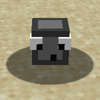

# Pet Rock Mod Download

## About

The Pet Rock Mod is a fun and quirky Minecraft modification that allows you to craft your very own pet rock. Here, you can find information about how to craft the pet rock spawner and where to download the mod.

### Crafting a Pet Rock Spawner

To craft a pet rock spawner, you'll need a few essential components. The first component is a "googly eye," which you can craft by surrounding black dye with paper in a crafting table. See the image below for reference:

Next, you'll need a rock. Rocks can be found scattered around the overworld.

Now that you have the necessary components, you can finally craft the pet rock spawner. Combine the googly eye and the rock in a crafting table as shown in the image below:

With your pet rock spawner ready, all that's left to do is spawn your pet rock. Right-click with the pet rock spawner to successfully spawn your pet rock.

## Downloads

- [Download Pet Rock Mod for Forge 1.17.1](versions/petrockmod%201.17.1.jar)
  
If you're unsure how to install Forge mods, we recommend reading this guide: [How to Install Minecraft Mods Using Minecraft Forge](https://www.wikihow.com/Install-Minecraft-Mods-Using-Minecraft-Forge).

Enjoy your new pet rock companion!

